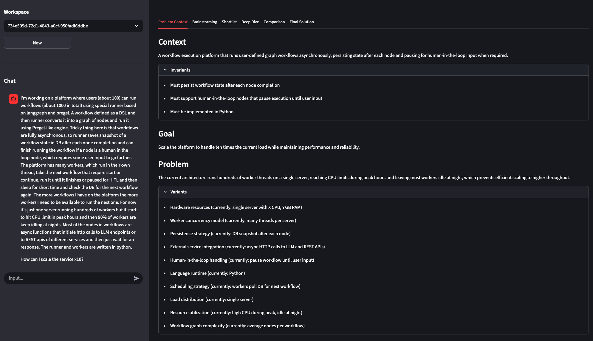
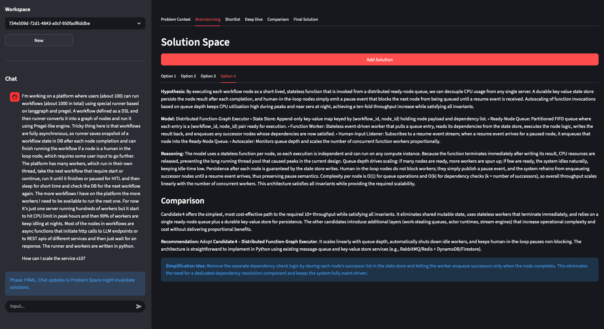
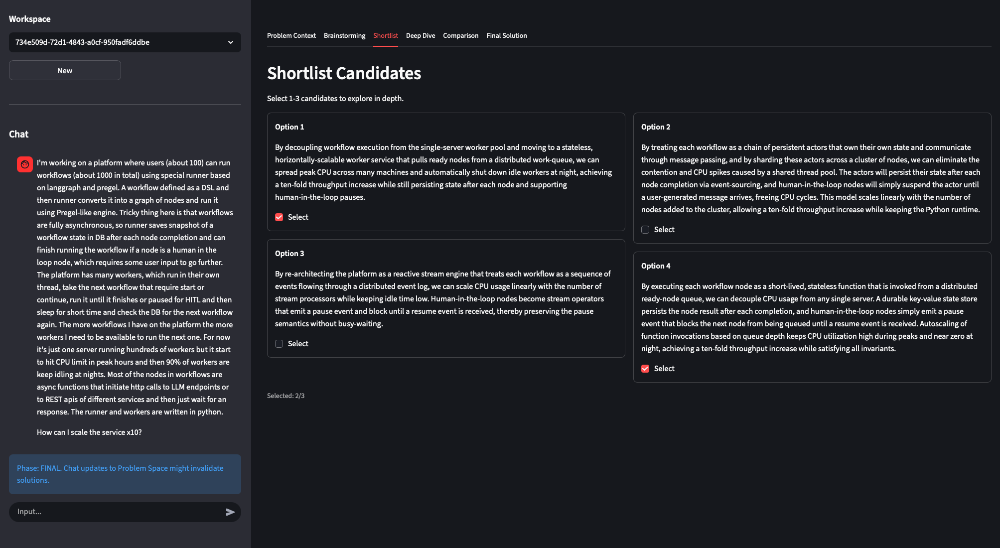
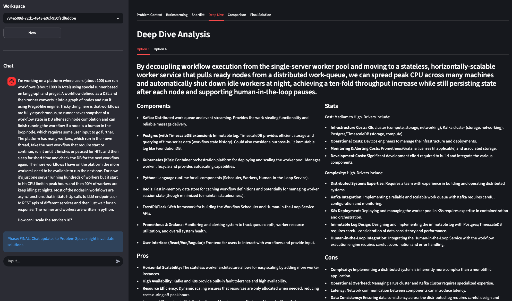
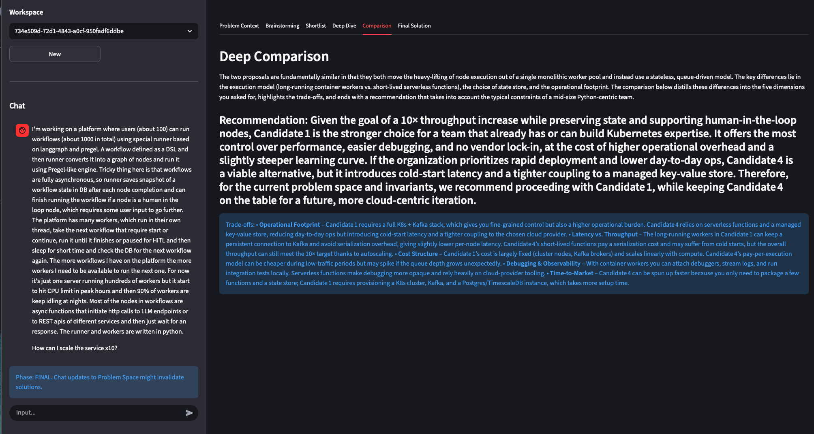
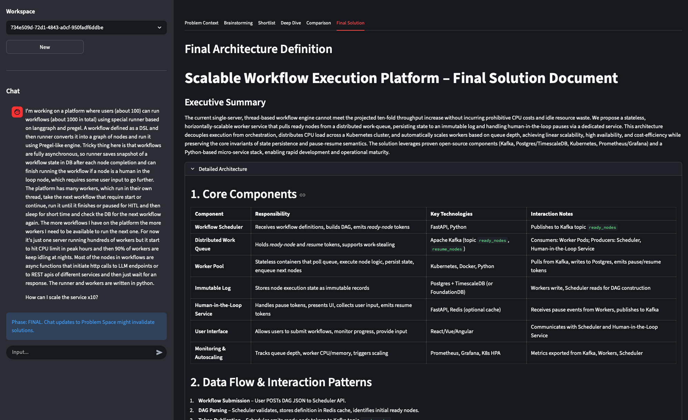

# System Design Companion

A collaborative agentic workspace for co-creating system designs. Unlike a simple chat bot, the System Design Companion maintains a structured understanding of your problem and evolves solution candidates alongside you through a rigorous, multi-stage workflow.



## 🌟 Vision

System design is a complex, iterative process. This tool acts as a **Companion**, not just an assistant. It listens to your ideas, maintains the state of the design (Invariants, Goals, Problems), triggers deep reasoning loops to draft and critique solutions, and persists versioned snapshots of your work.

## 🚀 Workflow & Features

The application guides you through a structured system design interview process, organized into dedicated phases:

### 1. Problem Context
The agent parses your natural language input to build a structured **Problem Space**, tracking:
-   **Goals**: What we are trying to achieve.
-   **Invariants**: Constraints that must hold true.
-   **Problems**: Current friction points or challenges.
-   **Variants**: Dimensions to explore.

You discuss the problem with the agent in the chat and the agent updates the problem space accordingly.


### 2. Brainstorming
Once the problem is defined, you can ask the agent to generate up to 10 candidate architectures (High-Level Designs). Explore different approaches to solve the key challenges.



### 3. Shortlist
Review the brainstormed candidates. You can select the most promising options to proceed with, filtering out those that don't fit the requirements or your preferences.



### 4. Deep Dive
For the shortlisted candidates, the system generates a detailed specification. This includes component breakdowns, data flows, and interface definitions.



### 5. Comparison
The agent performs a side-by-side comparison of the detailed solutions, analyzing trade-offs, scalability, consistency, and complexity.



### 6. Final Solution
Based on the comparison, a final recommendation is generated, synthesizing the best aspects of the chosen approach.



## 🛠️ Key Capabilities

*   **Split Interface**:
    *   **Sidebar**: Manages Workspace sessions, Version history, and the interactive Chat.
    *   **Main View**: Displays the structured state across the 6 workflow tabs.
*   **WIRL Workflow Engine**: Powered by a custom Workflow Intermediate Representation Language (WIRL), the agent connects cognitive nodes (Extract -> Draft -> Critique -> Refine).
*   **Versioning**: Every change is versioned. You can explore different branches of thought without losing previous work. (Not in UI yet).
*   **Persistence**: Workspaces are saved as human-readable json files.

## 🛠️ Setup

1.  **Prerequisites**:
    -   Python 3.12+
    -   [Ollama](https://ollama.com/) running locally (Recommended model: `gemma3:27b` or `gpt-oss:20b`).

2.  **Install**:
    ```bash
    python -m venv .venv
    source .venv/bin/activate
    pip install -r requirements.txt
    ```

3.  **Run**:
    ```bash
    streamlit run app/streamlit_app.py
    ```

4.  **Usage**:
    -   Open `http://localhost:8501`.
    -   **New Workspace**: Click "New" in the sidebar to start fresh.
    -   **Chat**: describe your system design problem (e.g., "Design a distributed rate limiter").
    -   **Iterate**: As you chat, the "Problem Context" tab updates.
    -   **Generate**: Follow the flow through the tabs to Brainstorm and refine solutions.

## 🏗️ Architecture

-   `app/`: Streamlit frontend components and UI logic.
-   `workflow_definitions/`: WIRL workflow files and Python capability implementations.
-   `workspaces/`: Local storage for user designs (JSON/Markdown).

## 📄 License

MIT License.
